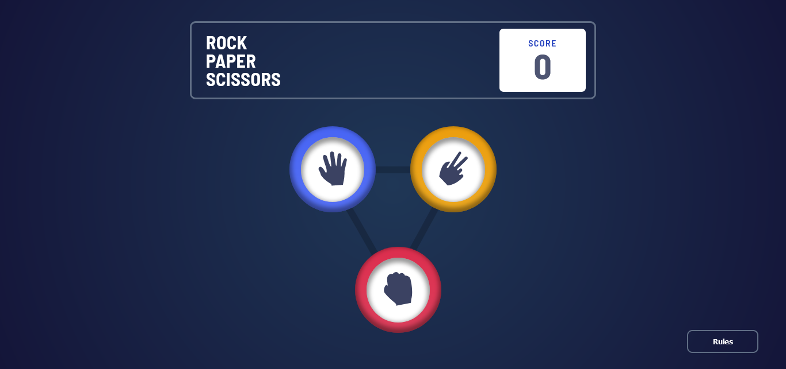

## Table of contents

- [Overview](#overview)
  - [The challenge](#the-challenge)
  - [Screenshot](#screenshot)
  - [Links](#links)
  - [Built with](#built-with)

## Overview

This is a simple rock, paper, scissors game.
play against your computer and see if you can get some points :)

### Screenshot

### Links

- Live Site URL: [Add live site URL here](https://maestro-rps.netlify.app/)

### Built with

- Semantic HTML5 markup
- Flexbox
- CSS Grid
- [React](https://reactjs.org/) - JS library
- [Styled Components](https://styled-components.com/) - For styles
